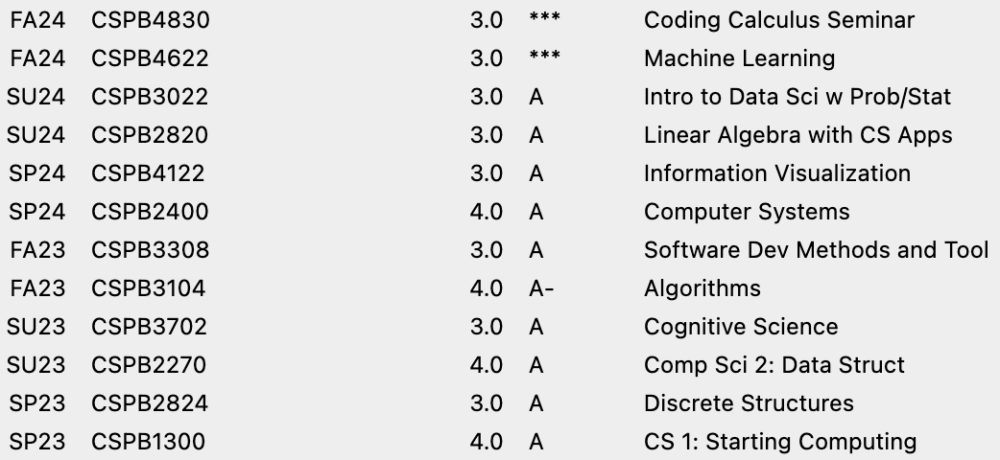

# Charlie Bailey's Computer Science Portfolio

Welcome to my professional portfolio! I am a Computer Science post-bacc student with experience in **machine learning, data science, linear algebra, algorithms, and software development**. Below you will find my projects, academic coursework, and contact info.

## Projects
### [Gradient Descent Implementation](projects/fp_grad_desc/README.md)
A ground-up implementation of the gradient descent algorithm—built from first principles.

### [BTC Price Prediction](https://github.com/charliebailey24/btc-prediction-model)
A deep learning approach to cryptocurrency price prediction using LSTM and GRU architectures, achieving better than baseline performance through systematic optimization.

## Academics
### Degree
Bachelors of Science (Post-Baccalaureate) in Applied Computer Science

### Institution
University of Colorado Boulder Department of Computer Science

### Unofficial Transcript
GPA: 3.965

Credit Hours: 34.0

### Coursework
#### [Coding Calculus](coding_calculus/README.md)
Python based course exploring the original numerical motivations for calculus though code.

## Contact
[Email](mailto:charliebailey24@gmail.com)

[X](@charliebailey24)