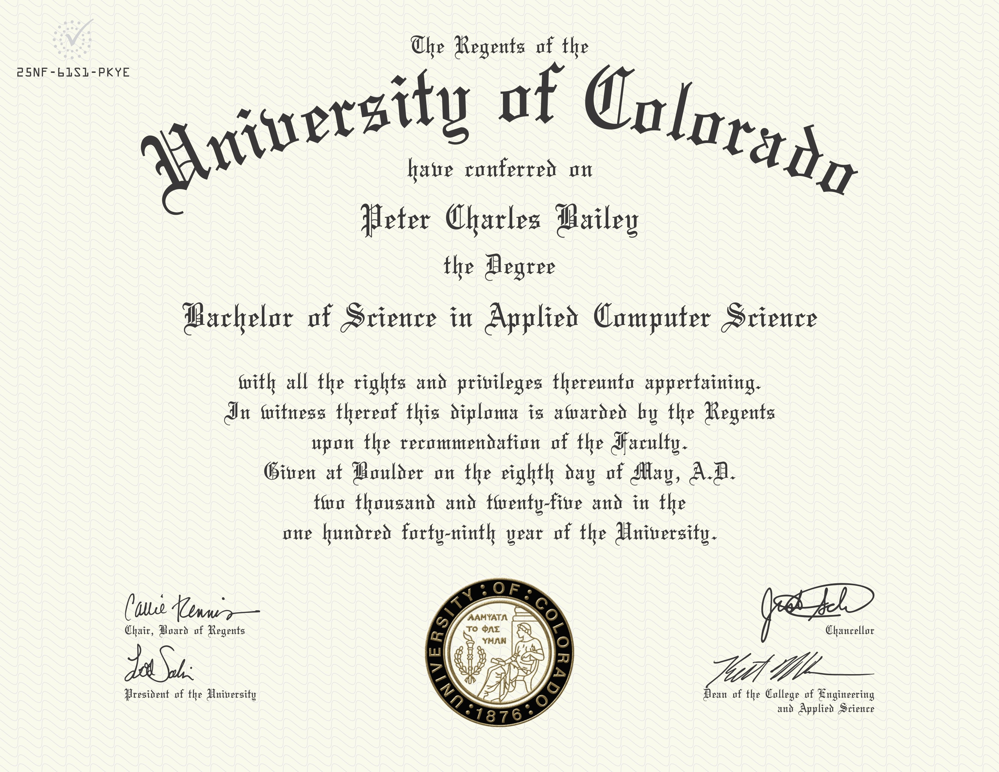

# Charlie Bailey's Computer Science Portfolio

<<<<<<< HEAD
Welcome to my professional portfolio! I am a recent Computer Science Post-Bacc grad with experience in **machine learning, artificial intelligence, natural language processing, data science, linear algebra, algorithms, and software development**. Below you will find my projects, academic coursework, and contact info.
=======
Welcome to my professional portfolio! I am a Computer Science Post-Bacc student with experience in **data structures, algorithms, linear algebra, numerical analysis, machine learning, AI, and NLP**. Below you will find my projects, academic coursework, and contact info.
>>>>>>> 340df93ccccac7b00920760b0c1b574547818c49

## Projects

### [Gradient Descent Implementation](https://github.com/charliebailey24/gradient-descent-implementation)

A ground-up implementation of the gradient descent algorithm—built from first principles.

### [BTC Price Prediction](https://github.com/charliebailey24/btc-prediction-model)

A deep learning approach to cryptocurrency price prediction using LSTM and GRU architectures, achieving better than baseline performance through systematic optimization.

### [Project Deep Understanding](https://github.com/charliebailey24/project-deep-understanding)

A work-in-progress personal project to build an LLM from scratch. Follow the updates on the [project blog](https://charliebailey24.github.io/project-deep-understanding/).

## Academics

### Institution

University of Colorado Boulder College of Engineering & Applied Science

### Degree

B.S. Applied Computer Science (May 2025) | GPA: 3.935

### [Courses](courses/README.md)

## Contact

Available for internship and full-time opportunities starting Summer 2025.

[Email](mailto:charliebailey24@gmail.com)

[𝕏](https://x.com/charliebailey24)
