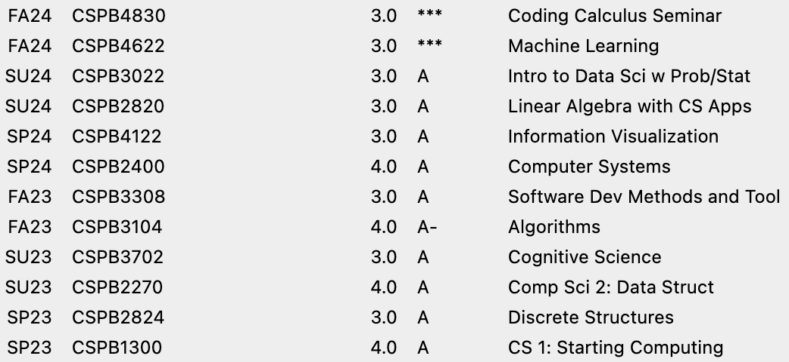

# Coursework

## Degree
Bachelors of Science (Post-Baccalaureate) in Applied Computer Science

## Institution
University of Colorado Boulder Department of Computer Science

## Unofficial Transcript
GPA: 3.965

Credit Hours: 34.0

