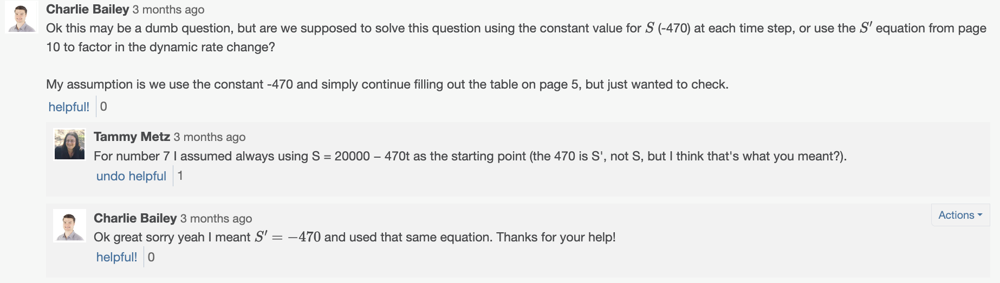
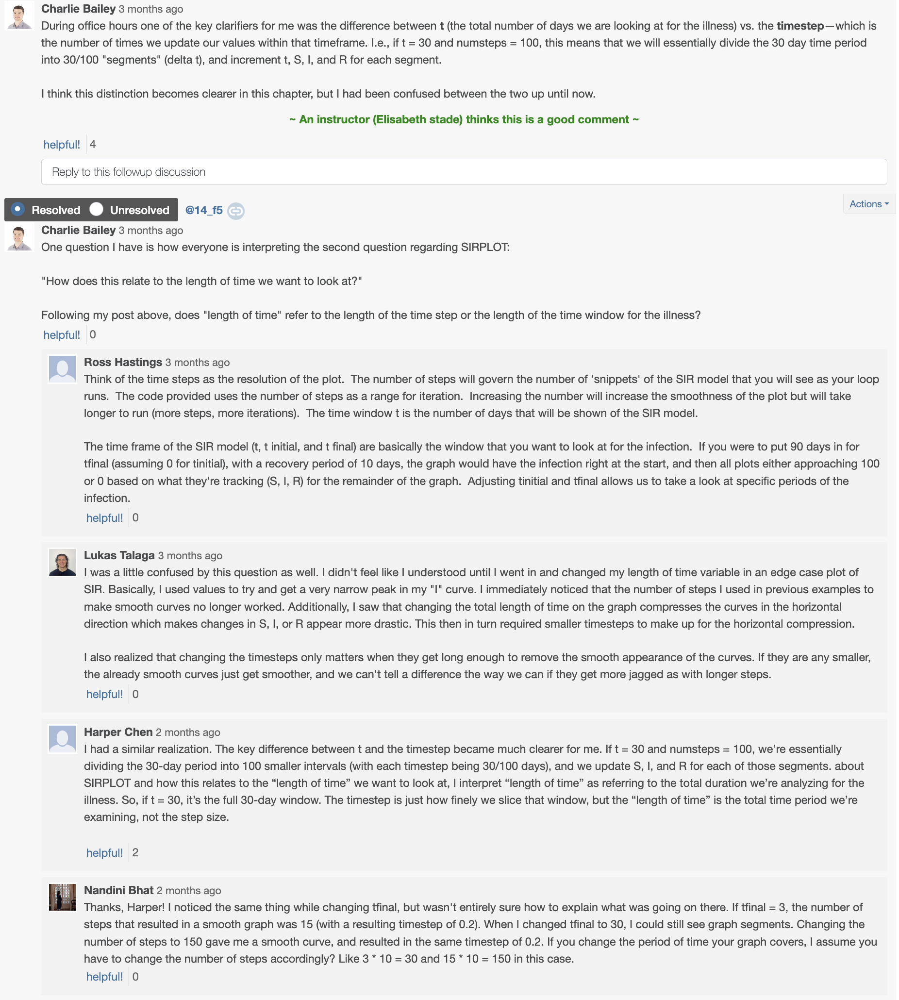
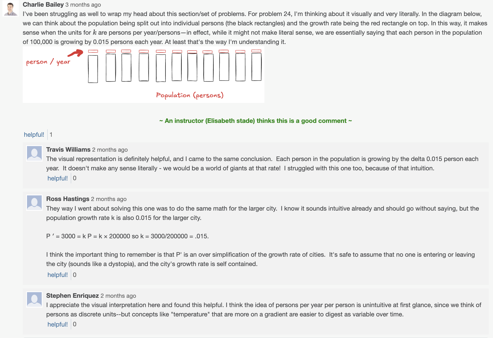
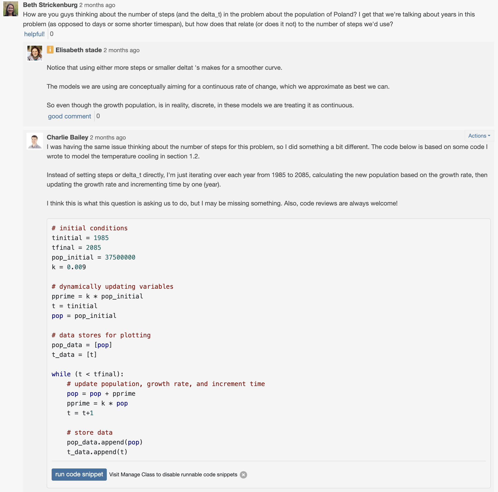
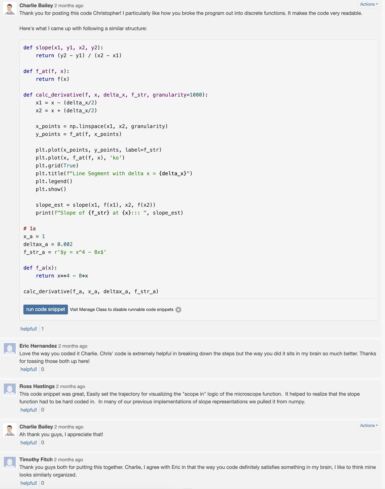
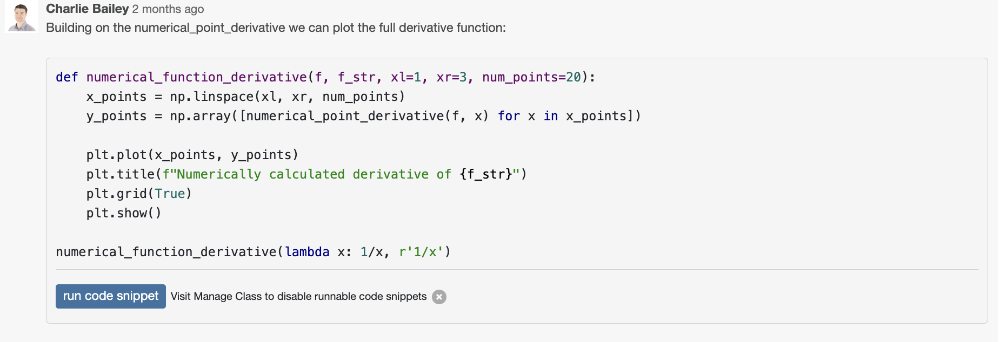
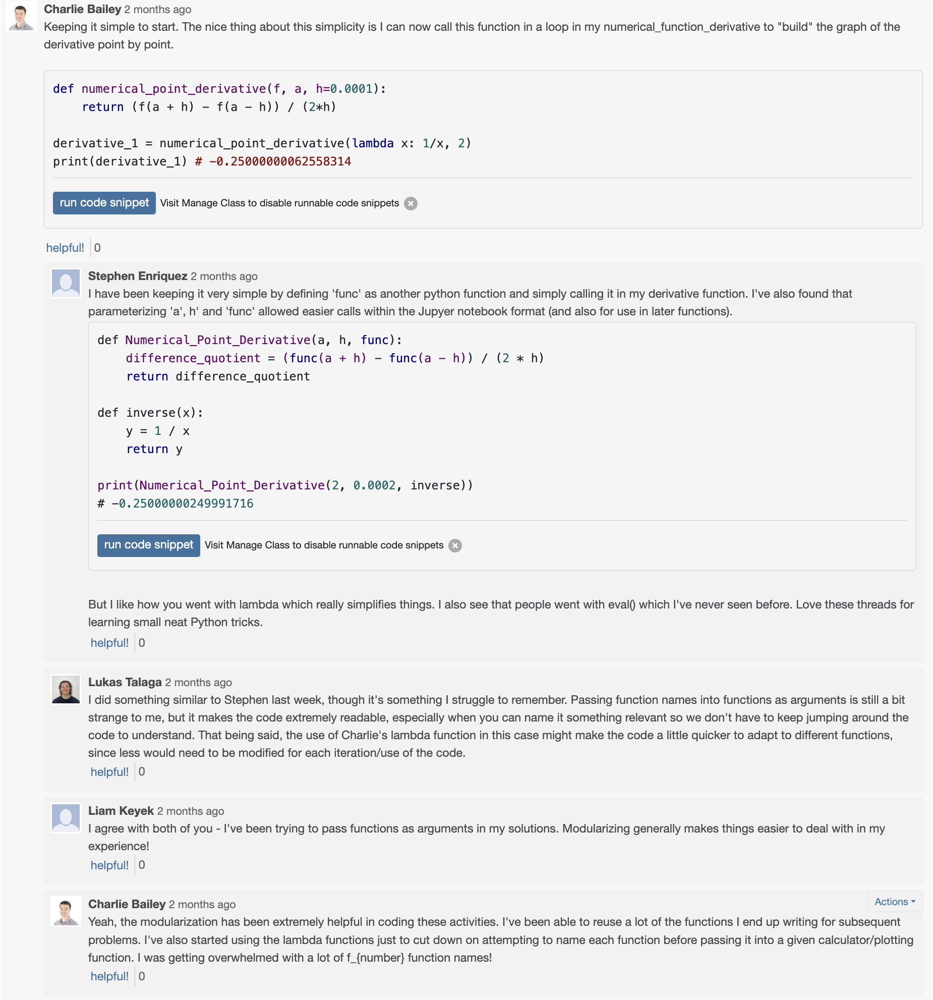
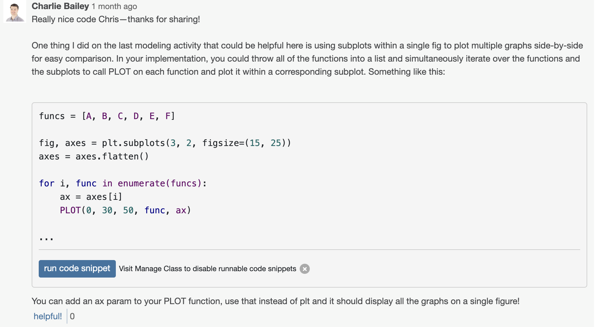
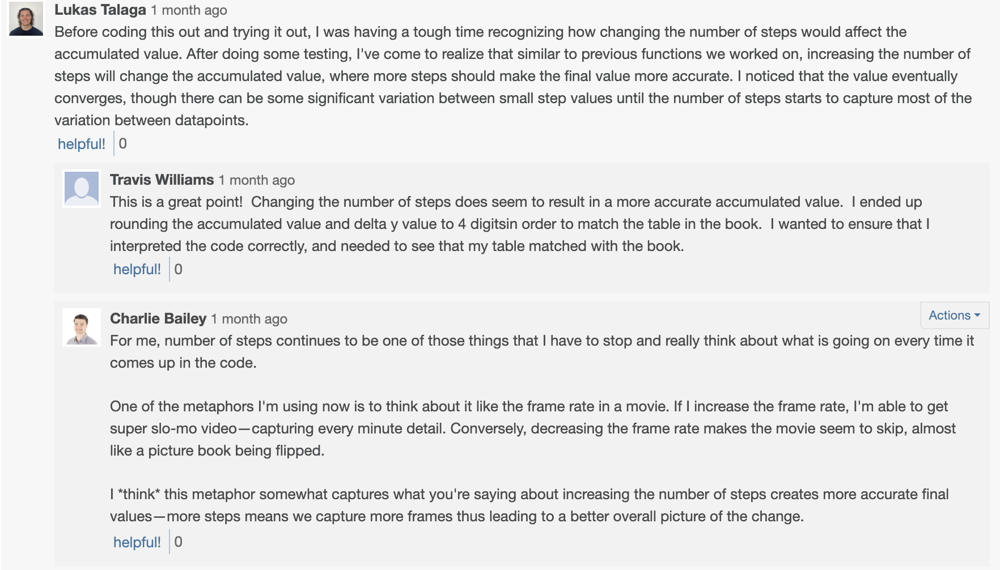

# CSPB 4830: Special Topics - Coding Calculus

[Full Portfolio on GitHub](https://github.com/charliebailey24/cs-portfolio)

Note: all other links in this readme are used to navigate the live GitHub repo and will not work in a downloaded PDF version.

## Description
Python based course exploring the original numerical motivations for calculus though code. In this course we coded and visualized: differential equations, infinite sequences, derivatives, integrals and model real world dynamical systems like pandemics, predator prey models and even wine making.

## Course text
Calculus in Context, Callahan, ISBN 0- 71672-630-0

## Technology used
Python, NumPy, Matplotlib, Desmos

## Skills acquired
* Numerical analysis
* Mathematical modeling
* Data visualization
* Differential equation modeling
* Calculus fundamentals

## Selected Work
The work I have selected to display here is broken out into three different categories based on the arc of the course. Numerical analysis and computational modeling were layered in throughout this course and provided a visual and conceptual framework upon which the fundamental components of calculus (the derivative and integral) were built.

The most exemplary work is contained in the [diffeq.ipynb](./modeling/diffeq.ipynb), in which I model various differential equations and utilize the methods learned in this course to build my own meat defrosting model (the results of which I use regularly). I would start here then explore the rest of the content as you see fit.

### [Modeling](modeling)
Explored population growth, pred-prey systems, and pandemic models using Python.
### [Derivatives](derivatives)
Visualized and coded numerical and symbolic methods for calculating derivatives, connecting conceptual theory to application.
### [Integrals](integrals)
Focused on numerical integration techniques with special focus on Riemann sums.

## Discussion Contributions

