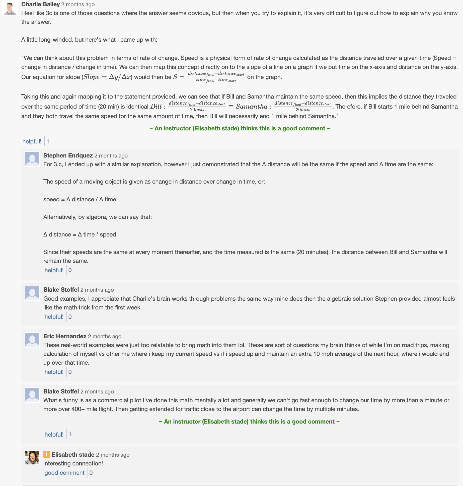

# CSPB 4830: Special Topics - Coding Calculus

## Description
Python based course exploring the original numerical motivations for calculus though code. In this course we coded and visualized: differential equations, infinite sequences, derivatives, integrals and model real world dynamical systems like pandemics, predator prey models and even wine making.

## Course text
Calculus in Context, Callahan, ISBN 0- 71672-630-0

## Work
### [Derivatives](derivatives)
### [Integrals](integrals)
### [Modeling](modeling)

## Discussion Contributions

